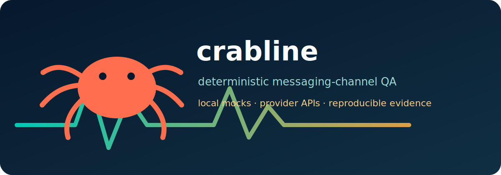

# crabline



Deterministic local messaging-channel mocks for OpenClaw QA.

`crabline` is config-driven, CI-friendly, and deliberately has no `openclaw`
dependency. It can run fixture-level local mocks, and it can also serve fake
provider APIs that OpenClaw live adapters can target during deterministic QA.

## What It Provides

- local mock providers for `discord`, `feishu`, `googlechat`, `imessage`,
  `loopback`, `matrix`, `mattermost`, `msteams`, `slack`, `telegram`,
  `whatsapp`, and `zalo`
- a `script` bridge for channels that are still exercised by external commands
- per-provider local webhook endpoints for inbound events
- fake provider servers for live-adapter smoke tests, starting with Slack,
  Telegram, and WhatsApp
- JSONL recorder files for deterministic wait/watch behavior
- nonce-based `send`, `roundtrip`, `agent`, `probe`, `run`, `watch`, and
  `doctor` commands
- text output by default and stable `--json` output for automation

Crabline fake servers are not live-provider coverage. They let OpenClaw run its
normal channel adapter code against a local provider-shaped API. Release lanes
still need the `live` driver and real provider credentials.

## Install

```bash
pnpm install
pnpm build
pnpm verify
```

Run locally:

```bash
pnpm dev fixtures --config fixtures/examples/crabline.example.yaml
pnpm dev roundtrip telegram-dm --config fixtures/examples/crabline.example.yaml
```

## Quality Gate

```bash
pnpm verify
```

That enforces formatting, typecheck, type-aware lint, and Vitest coverage.

## Config

Config file search order:

1. `--config <path>`
2. `./crabline.yaml`
3. `./crabline.yml`
4. `./crabline.json`

Top-level shape:

```yaml
configVersion: 1
userName: crabline
providers:
  telegram:
    adapter: telegram
    telegram:
      recorder:
        path: ./.crabline/recorders/telegram.jsonl
      webhook:
        host: 127.0.0.1
        port: 8790
        path: /telegram/webhook
fixtures:
  - id: telegram-dm
    provider: telegram
    mode: roundtrip
    target:
      id: "100000001"
      behavior: agent
```

Provider ids are local profile names. Fixtures reference them through
`provider`. Built-in adapters infer their platform from `adapter`; `platform` is
required only for `adapter: script`.

Built-in provider credentials are optional metadata only. `doctor` checks
explicit `env` declarations, script command availability, and config shape; it
does not require live Slack, Discord, Telegram, WhatsApp, Matrix, iMessage, or
other platform secrets for local mocks.

## Built-In Mock Channels

All built-in mock providers support:

- `probe`
- `send`
- `roundtrip`
- `agent`
- `watch`

The built-in providers are:

- `discord`
- `feishu`
- `googlechat`
- `imessage`
- `loopback`
- `matrix`
- `mattermost`
- `msteams`
- `slack`
- `telegram`
- `whatsapp`
- `zalo`

The `script` adapter can bridge any other OpenClaw channel by running local
commands for `probe`, `send`, `waitForInbound`, or `watch`.

## Fake Provider Servers

`serve` starts provider-shaped HTTP APIs for OpenClaw live adapters. This is the
preferred Smoke CI path because OpenClaw still uses its normal channel adapter,
but the provider endpoint is local and deterministic.

Slack:

```bash
crabline --json serve slack --ready-file .crabline/slack-server.json
```

The JSON manifest contains:

- `endpoints.apiRoot`: set OpenClaw's Slack API override / `SLACK_API_URL` to
  this value
- `botToken`: set OpenClaw `channels.slack.botToken` to this value
- `signingSecret`: set OpenClaw `channels.slack.signingSecret` to this value
- `adminToken`: send this as the `X-Crabline-Admin-Token` header when posting
  test user messages
- `endpoints.adminInboundUrl`: authenticated POST endpoint for Events API-shaped
  test user messages
- `endpoints.eventsUrl`: local Slack Events API endpoint
- `recorderPath`: JSONL file of fake provider API/admin traffic

The admin token is generated randomly unless `--admin-token <token>` is
provided. Implemented Slack Web API endpoints include `auth.test`,
`chat.postMessage`, `conversations.open`, `conversations.info`,
`conversations.history`, and `conversations.replies`.

Telegram:

```bash
crabline --json serve telegram --ready-file .crabline/telegram-server.json
```

The JSON manifest contains:

- `endpoints.apiRoot`: set OpenClaw `channels.telegram.apiRoot` to this value
- `botToken`: set OpenClaw `channels.telegram.botToken` to this value
- `adminToken`: send this as the `X-Crabline-Admin-Token` header when posting
  test user messages
- `endpoints.adminInboundUrl`: authenticated POST endpoint for test user
  messages; OpenClaw reads them through Telegram `getUpdates`
- `recorderPath`: JSONL file of fake provider API/admin traffic

The admin token is generated randomly unless `--admin-token <token>` is
provided. The inbound endpoint rejects requests without the matching admin
header (or `Authorization: Bearer <token>`).

Implemented Telegram Bot API endpoints include `getMe`, `sendMessage`,
`editMessageText`, `deleteMessage`, `setMessageReaction`, `createForumTopic`,
`editForumTopic`, `pinChatMessage`, `unpinChatMessage`, `getUpdates`,
`deleteWebhook`, `setWebhook`, `setMyCommands`, `deleteMyCommands`,
`sendChatAction`, and `answerCallbackQuery`.

WhatsApp:

```bash
crabline --json serve whatsapp --ready-file .crabline/whatsapp-server.json
```

The JSON manifest contains:

- `endpoints.apiRoot`: Crabline WhatsApp fake provider API root
- `accessToken`: bearer token for fake provider requests
- `adminToken`: send this as the `X-Crabline-Admin-Token` header when posting
  test user messages
- `selfJid`: fake authenticated WhatsApp user JID
- `env.CRABLINE_WHATSAPP_ACCESS_TOKEN`: access token for the runtime socket
  factory
- `env.CRABLINE_WHATSAPP_API_ROOT`: API root for the runtime socket factory
- `env.CRABLINE_WHATSAPP_RECORDER_PATH`: recorder file followed by the runtime
  socket factory for cross-process inbound delivery
- `env.CRABLINE_WHATSAPP_SELF_JID`: fake authenticated WhatsApp user JID for
  the runtime socket factory
- `endpoints.adminInboundUrl`: authenticated POST endpoint for test user
  messages; subscribed Baileys mock sockets receive them as `messages.upsert`
- `endpoints.messagesUrl`: fake text send endpoint used by the Baileys-shaped
  mock
- `endpoints.presenceUrl`: fake presence endpoint used by
  `sendPresenceUpdate`
- `recorderPath`: JSONL file of fake provider API/admin traffic

Use the package subpath `@openclaw/crabline/whatsapp-socket-factory` when a
runtime needs a Baileys-style module with `createWhatsAppSocket()`. The module
reads the `CRABLINE_WHATSAPP_*` env vars emitted by the manifest, sends outbound
traffic to the fake provider API, and follows the recorder for inbound
`messages.upsert` events. The admin token is generated randomly unless
`--admin-token <token>` is provided.

OpenClaw bridge callers should post injected user messages with the
`providerUrl`, `providerHeaders`, and `providerBody` returned by
`createOpenClawCrablineInbound()`. For direct in-process tests, the started fake
server also exposes `createBaileysMockSocket()`.

## Target IDs

Built-in providers accept native channel identifiers. Crabline does not add
`telegram:`, `discord:`, `slack:`, or other local prefixes.

```yaml
target:
  id: "C1234567890"
```

Thread targets use the platform's native thread identifier:

```yaml
target:
  channelId: "C1234567890"
  threadId: "1700000000.000100"
```

Examples:

- Slack conversations: `C1234567890`, `G1234567890`, or `D1234567890`
- Slack threads: `1700000000.000100`
- Telegram chats: `-1001234567890` or `@channelusername`
- Telegram topics: `42`
- WhatsApp users: `15551234567@s.whatsapp.net`
- WhatsApp groups: `120363001234567890@g.us`
- Discord channels and threads: Discord snowflake ids such as
  `123456789012345678`

## Webhooks

Each built-in provider starts a local webhook during `probe`, `waitForInbound`,
or `watch`. Webhook requests can use the provider's native event shape, or this
simple JSON shape with native thread ids:

```json
{
  "id": "slack-inbound-1",
  "threadId": "C1234567890",
  "text": "reply nonce-123",
  "author": "assistant"
}
```

Nested message payloads are also accepted:

```json
{
  "message": {
    "id": "slack-inbound-1",
    "threadId": "C1234567890",
    "text": "reply nonce-123"
  }
}
```

Malformed webhooks return `400`, and non-JSON requests return `415`.

## Evidence Flow

`send` records an outbound user event in the provider recorder. For `roundtrip`
and `agent` modes, the local mock also records a deterministic assistant reply:

```text
[telegram mock] hello nonce-123
```

`waitForInbound` reads the recorder until it finds a matching non-user event.
`watch` streams matching recorder events. This gives CI channel coverage without
live service latency, external credentials, webhooks exposed to the internet, or
provider SDK state.

## More Setup Detail

See [Channel Setup](docs/channel-setup.md) for the provider matrix, webhook
paths, and OpenClaw live-vs-mock guidance.
